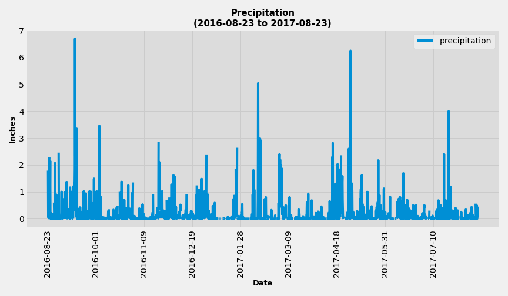
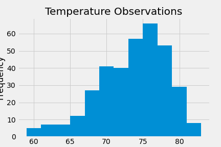

# SQLAlchemy-Challenge - Surfs Up!

Analysis and exploration of Hawaii's climate data: 
* Step 1 - Climate Analysis and Exploration
* step 2 - Climate App

## Step 1 - Climate Analysis and Exploration

Used Python and SQLAlchemy to do basic climate analysis and data exploration of the climate database using SQLAlchemy ORM queries, Pandas, and Matplotlib.

### Precipitation Analysis

* Used most recent date in the data set to retrieve the last 12 months of precipitation data by querying the 12 preceding months of data. Below is the `date` and `prcp` values plot.

 

* Used Pandas to print the summary statistics for the precipitation data.

### Station Analysis

*  Calculated the total number of stations in the dataset and designed a query to find the most active stations (i.e. stations with the most rows).

* Also designed a query to retrieve the last 12 months of temperature observation data (TOBS) and plotted the results as a histogram with `bins=12`.

 

- - -

## Step 2 - Climate App

Designed a Flask API based on the queries and used Flask to create routes:

### Routes

* `/`

  * Home page.

  * List of all available routes:

* `/api/v1.0/precipitation`

 * `/api/v1.0/stations`

 * `/api/v1.0/tobs`

* `/api/v1.0/<start>` and

 `/api/v1.0/<start>/<end>`

- - -

## Bonus Challenge

### Temperature Analysis I

### Temperature Analysis II

### Daily Rainfall Average

- - -